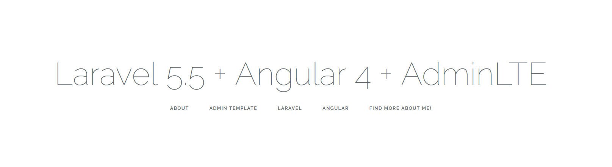

# Laravel 5.5 + Angular 5 + AdminLTE

This is a simple Single Page Application starter for [Laravel 5.5.x](https://laravel.com) + [Angular 5](https://angular.io/) and [AdminLTE](https://github.com/almasaeed2010/AdminLTE).

#### Notice
[For the older version with Angular 4 check this branch](https://github.com/ilirhushi/laravel5.5-angular4/tree/angular-4)

## Installation

- Clone the repository
- then run `composer install` and follow Laravel [documentation](https://laravel.com/docs/5.5)
- and then run `npm install` inside resources/assets/src/my-app directory and follow [Angular CLI Documentation](https://github.com/angular/angular-cli)

This project was generated with [Angular CLI](https://github.com/angular/angular-cli) version 1.6.7.

## Development server

Run `ng serve` for a dev server. Navigate to `http://localhost:4200/`. The app will automatically reload if you change any of the source files.

## Code scaffolding

Run `ng generate component component-name` to generate a new component. You can also use `ng generate directive|pipe|service|class|guard|interface|enum|module`.

## Build

Run `ng build` to build the project. The build artifacts will be stored in the `dist/` directory. Use the `-prod` flag for a production build.

## Running unit tests

Run `ng test` to execute the unit tests via [Karma](https://karma-runner.github.io).

## Running end-to-end tests

Run `ng e2e` to execute the end-to-end tests via [Protractor](http://www.protractortest.org/).

## Further help

To get more help on the Angular CLI use `ng help` or go check out the [Angular CLI README](https://github.com/angular/angular-cli/blob/master/README.md).
 
If you have any questions please use the Issues tab or submit a pull request. I tried to keep this as simple as possible just the basic form of a starter repository to be able to use Angular 5 with Laravel 5.5 as the backend.

## Contributors
[@ilirhushi](http://ilirhushi.me)

### License
This project is open-sourced software licensed under the [MIT license](https://opensource.org/licenses/MIT).

## TODO
Coming soon integration with Redux - [Ngrx/Platform](https://github.com/ngrx/platform)
